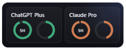

<p align="center">
  
</p>

<h1 align="center">UsageGuard</h1>
<p align="center">A local-first Windows widget and CLI for tracking AI spend, quotas, and subscription usage without dashboard noise.</p>
<p align="center"><strong>Windows x64 release binaries | PowerShell one-line install | No Rust required for end users</strong></p>

UsageGuard keeps provider usage visible in a small desktop surface instead of burying it across multiple dashboards. It supports subscription-backed OAuth sources, API-key providers, and local encrypted secret storage on Windows.

## Highlights
- Frameless Windows widget with compact `5h` and `week` usage rings
- ChatGPT and Claude subscription usage via browser OAuth
- OpenAI, Anthropic, and Cursor API usage via built-in audited endpoints
- Local DPAPI-encrypted secret storage for API keys and OAuth refresh tokens
- CLI for config inspection and demo workflows

## Install
### One-line Windows install
The installer downloads the latest Windows release from GitHub, extracts the binaries, and adds them to your user `PATH`.

```powershell
irm https://raw.githubusercontent.com/openchert/usage-guard/main/install.ps1 | iex
```

### Manual Windows install
1. Download `usage-guard-windows-x64.zip` from GitHub Releases.
2. Extract the archive.
3. Run `usageguard-desktop.exe` for the widget or `usageguard.exe` for the CLI.

### Verify release integrity
Each release includes `SHA256SUMS`.

```powershell
Get-FileHash .\usage-guard-windows-x64.zip -Algorithm SHA256
```

Compare the reported hash with the matching entry in `SHA256SUMS`.

## Supported Connections
- OpenAI `oauth`: ChatGPT subscription usage via `https://chatgpt.com/backend-api/wham/usage`
- Anthropic `oauth`: Claude subscription usage via `https://api.anthropic.com/api/oauth/usage`
- OpenAI `api`: organization costs endpoint
- Anthropic `api`: organizations usage endpoint
- Cursor `api`: team spend endpoint

## Quick Start
### Desktop
1. Open `usageguard-desktop`.
2. Click the `+` button on the widget or open the native right-click menu.
3. Choose **Manage Providers...**
4. Connect ChatGPT or Claude with OAuth, or add a provider account with an API key.

### CLI
```bash
usageguard config --openai-key "sk-..."
usageguard config --anthropic-key "sk-ant-..."
usageguard demo
```

## Security
On Windows, API keys and OAuth refresh tokens are stored in a DPAPI-encrypted blob at `%APPDATA%\usage-guard\secrets.bin`. Access tokens stay in memory only and are refreshed when needed.

Provider fetches are limited to built-in audited endpoints in this hardened release. Custom endpoint overrides and custom provider profiles are not used for outbound requests.

See [`docs/SECURITY.md`](docs/SECURITY.md) for storage, OAuth, and threat-model details.
See [`docs/PROVIDERS.md`](docs/PROVIDERS.md) for the provider/source display model.

## Local Development
```bash
npm install --prefix crates/usageguard-desktop/ui
cargo test
cargo run -p usageguard-cli -- demo
cargo run -p usageguard-desktop
```

The desktop crate builds the UI through Tauri's `beforeBuildCommand`, so Node.js and npm are required for local desktop runs.

## Troubleshooting
- If the install command succeeds but `usageguard` is not found, restart the terminal so `PATH` is reloaded.
- If ChatGPT OAuth sign-in fails, make sure nothing else is using `localhost:1455`.
- If Claude OAuth sign-in fails, make sure nothing else is using `localhost:45454`.
- If the widget shows `Status: Unable to load provider usage right now.`, verify the API key or reconnect the OAuth source.
- If secure storage is unavailable, UsageGuard does not fall back to plaintext secret persistence.

## Release Flow
- GitHub Actions builds and publishes Windows x64 binaries on tag push (`v*`).
- Release assets are attached to GitHub Releases as `usage-guard-windows-x64.zip` plus `SHA256SUMS`.

Create a release build:

```bash
git tag v0.4.1
git push origin v0.4.1
```
