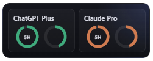

<p align="center">
  
</p>

<h1 align="center">UsageGuard</h1>
<p align="center">A local-first desktop widget and CLI for tracking Codex and Claude Code subscription usage without dashboard noise.</p>

UsageGuard keeps local subscription usage visible in a small desktop widget instead of burying it behind client UIs. It runs locally on Windows and Linux and works from the Codex and Claude Code setup already present on the machine.

## What It Does
- Tracks local Codex quota windows from recent session logs, with a built-in local-token fallback when needed
- Tracks local Claude Code quota windows from the local credentials file, including the weekly window when the local upstream response exposes it
- Shows compact cards with hover details for usage, reset times, and connection status
- Sends native desktop notifications and shows in-widget alert badges for quota conditions
- Includes widget and tray controls for `Light Mode`, `Always on Top`, `Refresh`, show/hide, and `Start on Login`
- Includes an optional CLI for printing the current local snapshot state

## Install
### Windows
The installer downloads the latest Windows release from GitHub, extracts the binaries, adds them to your user `PATH`, creates a Start Menu shortcut so UsageGuard appears in Windows Search, enables `Start on Login` on first install, and launches the widget.

Windows PowerShell:

```powershell
irm https://raw.githubusercontent.com/openchert/usage-guard/main/install.ps1 | iex
```

Windows CMD:

```cmd
powershell -NoProfile -ExecutionPolicy Bypass -Command "irm 'https://raw.githubusercontent.com/openchert/usage-guard/main/install.ps1' | iex"
```

If you prefer `curl.exe`, download the script first and then run it:

```cmd
curl.exe -L https://raw.githubusercontent.com/openchert/usage-guard/main/install.ps1 -o "%TEMP%\install-usageguard.ps1"
powershell -NoProfile -ExecutionPolicy Bypass -File "%TEMP%\install-usageguard.ps1"
```

Manual install:

1. Download `usage-guard-windows-x64.zip` from GitHub Releases.
2. Extract the archive.
3. Run `usageguard-desktop.exe` for the widget or `usageguard.exe` for the CLI.

Manual ZIP installs do not add the Windows Search shortcut or the `Start on Login` entry automatically.

### Linux
UsageGuard publishes x86_64 Linux desktop builds on GitHub Releases as `.deb` and `.AppImage` assets.

Debian / Ubuntu:

1. Download the latest `UsageGuard_*_amd64.deb` release asset.
2. Install it with `sudo apt install ./UsageGuard_*_amd64.deb`.
3. Launch `UsageGuard` from your applications menu.

Portable AppImage:

1. Download the latest `UsageGuard_*.AppImage` release asset.
2. Run `chmod +x UsageGuard_*.AppImage`.
3. Launch it with `./UsageGuard_*.AppImage`.

The first Linux release does not ship a one-line installer or package repository yet. Updates come from new GitHub release assets.

## Linux Compatibility
- `.deb` installs are the recommended Linux path. They provide launcher integration and are the most stable option for `Start on Login`.
- `.AppImage` builds stay portable. If you enable `Start on Login`, the autostart entry points at the exact AppImage path you launched, so moving or replacing the file later requires turning the toggle off and on again.
- Native notifications use the desktop notification service exposed by your Linux desktop environment.
- Tray support depends on the desktop environment. If no tray is available, UsageGuard keeps the main widget window visible so the app remains usable.
- On Linux, `Start on Login` writes a managed XDG autostart entry at `${XDG_CONFIG_HOME:-~/.config}/autostart/com.usageguard.app.desktop`.

## Supported Connections
- Codex consumer usage through local Codex sign-in files: fresh `~/.codex/sessions/*.jsonl` quota logs first, then a built-in fallback fetch using the token from `~/.codex/auth.json`
- Claude Code consumer usage through local Claude Code credentials: plan/status from `~/.claude/.credentials.json`, plus a built-in quota fetch using the local `accessToken` from that file

## Alerts
UsageGuard ships with native desktop notifications and an in-widget alert state for the most important quota conditions.

- Local Codex consumer sources watch both the `5h` and `week` windows
- Near-limit alerts fire at `90%` used for `5h` and `80%` used for `week`
- Use-before-reset reminders fire when a reset is close and usage is still low
- Claude Code local detection uses the local credentials file plus a built-in quota fetch; the app exposes the `5h` window and also surfaces `week` when the upstream response includes a longer secondary window

See [`docs/ALERTS.md`](docs/ALERTS.md) for the full alert model and delivery behavior.

## Quick Start
### Desktop widget
1. Launch `usageguard-desktop`.
2. Open **Manage Connections...** from the widget right-click menu or the tray menu.
3. Sign in to Codex or Claude Code on this machine.
4. Hover any card for details and keep the widget running for notifications and alert badges.

### Optional CLI
```bash
usageguard status
```

## Updates
- On Windows, update by running the same install command or script again. It always pulls the latest GitHub release and replaces the installed binaries.
- On Linux, update by installing the newest `.deb` or replacing the `.AppImage` with the latest GitHub release asset.
- Re-running the Windows installer refreshes the Start Menu shortcut and preserves an existing disabled `Start on Login` setting.
- The desktop app checks GitHub Releases in the background on startup and shows a native notification when a newer version is available.

## Security
UsageGuard reads local Codex and Claude Code client files and only uses those local tokens in memory when a built-in consumer usage fetch is needed. It does not manage external provider credentials.

See [`docs/SECURITY.md`](docs/SECURITY.md) for storage, local consumer imports, and threat-model details.
See [`docs/LOCAL_CONSUMER_SOURCES.md`](docs/LOCAL_CONSUMER_SOURCES.md) for the exact local-file and token-backed acquisition flow.
See [`docs/ALERTS.md`](docs/ALERTS.md) for alert thresholds, native notifications, and widget badges.
See [`docs/PROVIDERS.md`](docs/PROVIDERS.md) for the provider/source display model.

## License
MIT. See [`LICENSE`](LICENSE).

## Troubleshooting
- If the install command succeeds but `usageguard` is not found, restart the terminal so `PATH` is reloaded.
- If you use `curl.exe`, remember it only downloads `install.ps1`; you still need to run the second `powershell -File ...` command, or use the one-line CMD install command above.
- If `irm` is unavailable, use `Invoke-RestMethod`, `Invoke-WebRequest`, `curl.exe`, or the manual ZIP install above.
- If the Codex card stays in local-status mode, run at least one Codex request so a fresh session log exists under `~/.codex/sessions`. UsageGuard prefers those local logs and only falls back to the `auth.json` token-backed fetch when the logs are stale or missing.
- If the Claude Code card stays in syncing or pending status, confirm Claude Code is signed in on this machine and that `~/.claude/.credentials.json` still contains a valid local `accessToken`.
- Claude Code weekly support appears automatically in the widget and connections window as soon as the local quota snapshot includes a secondary window.
- If the widget shows a provider load failure, verify the local client sign-in.
- On Linux desktop environments that do not expose a tray icon, UsageGuard stays usable from the main widget window and connections window.
- On Linux AppImage installs, re-enable `Start on Login` after moving or replacing the AppImage so the autostart path stays current.
